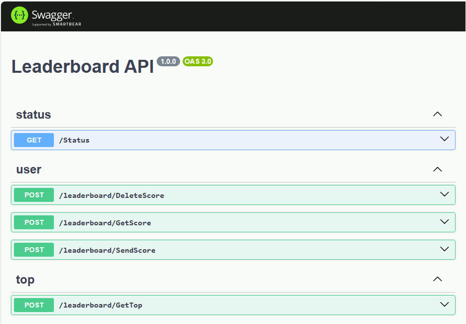

# Leaderboard server

## Introduction

This is a demo Node.js (Typescript) project that implements server logic of the game leaderboard. Key features are:
* Flexible modular structure.
* Validation of input and output request parameters based on OpenAPI (formerly Swagger) specifications.
* Automatic generation of documentation based on the full OpenAPI specification and the ability to display it through Swagger UI.
* Support for multiple relational and non-relational databases: Redis, MongoDB, DynamoDB, PostgreSQL, MySQL and others.
* Testing database functionality (unit tests) through emulators and docker containers.

Please keep in mind that for a full launch in production this project lacks some important features, such as a request authorization mechanism.


## Prerequisites

* [Node.js](https://nodejs.org) 20.x
* [Docker](https://www.docker.com) (to run tests)

To install required npm modules use the command line :
```
npm install
```


## Configuring

You can set the necessary settings in the file [src/Config.ts](src/Config.ts)


## NPM scripts

* `npm run lint` - checking with a static code analyzer (ESLint)

* `npm run test` - running tests

> **NOTE**
> Please keep in mind that running the tests for the first time may take a long time due to downloading the necessary docker images

* `npm run build` - building the project

* `npm run start` - launching the project


## API specification

By default, you can access Swagger UI at http://localhost:8415/apidoc/ after starting the server.

<p align="center">
	
</p>


## DB Providers

Any available DB provider can be used depending on your needs.

* **In-memory**. Simplest storage in RAM (per process). Only for testing purpose.

* **Redis**. An open-source in-memory storage.

* **DynamoDB**. A fully managed proprietary NoSQL database offered by Amazon.com as part of the Amazon Web Services. To create the necessary tables and indexes, use [dbTables.json](src/lib/db/dynamodb/dbTables.json)

* **MongoDB**. A document-oriented NoSQL database product. To create the necessary collections and indexes, use script [setup.mongodb.cjs](src/lib/db/mongodb/setup.mongodb.cjs)

* **PostgreSQL**. A free and open-source relational database management system. To create the necessary tables and indexes, use script [dbSetup.sql](src/lib/db/postgresql/dbSetup.sql)

* **MySQL**. An open-source relational database management system. To create the necessary tables and indexes, use script [dbSetup.sql](src/lib/db/mysql/dbSetup.sql)


## Keywords
leaderboard, node.js, typescript, nestjs, express, openapi, swagger, jest, docker, redis, dynamodb, mongodb, postgresql, mysql